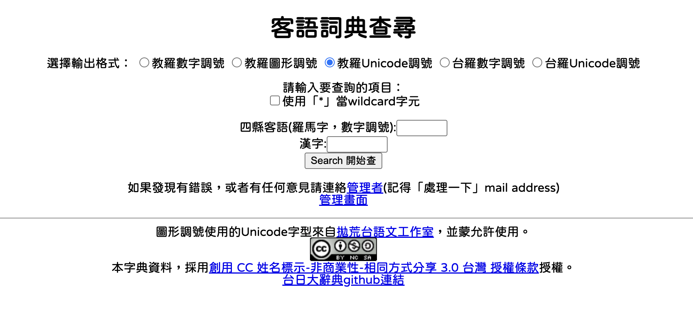

# HakfaFHLDictDataMirror

Data mirror for the [台語信望愛客語辭典 (Hak-fa FHL Dictionary)](https://hakka.fhl.net/dict/index_hakka.html).

This project mirrors the Hak-fa FHL Dictionary data, capturing both Numeric and Unicode Roman Orthography for all entries.

## License



- [創用 CC 姓名標示-非商業性-相同方式分享 3.0 台灣 授權條款](https://creativecommons.org/licenses/by-nc-sa/3.0/tw/)
- Source: [台語信望愛客語辭典 (Hak-fa FHL Dictionary)](https://hakka.fhl.net/dict/index_hakka.html)

## Latest Version

Check [**manifest.json**](./public/manifest.json) for the current `latest_version`.

## Accessing Files

Each version directory has two siblings, modeled after [HakkaDictMoeDataMirror](https://github.com/ThoivanHakfa/HakkaDictMoeDataMirror):

- `public/{version_id}/tangloo/HakfaFHLDict.csv` — **raw archive** (FHL data verbatim, no conversion)
- `public/{version_id}/bunji/HakfaFHLDict.csv` — **derived output** (FHL → PFS + IPA)

Each CSV has a sibling `.json` of the same name.

## Data Format

### `tangloo/HakfaFHLDict.csv` (raw archive)

- `ID`: FHL database ID
- `FHL_DICT_Numeric`: Original FHL Roman Orthography with POJ-style numeric tones (1–8; Si-yen uses 1,2,3,4,5,8), as served by `graph=0`
- `FHL_DICT_Unicode`: Original FHL Roman Orthography with Unicode diacritics, as served by `graph=2`
- `Hanzi`: Chinese Characters (漢字)
- `Tai-gi`: Taigi Explanation (台語解說)
- `Hakfa-exp`: Hak-fa Explanation (客語解說)
- `Hua-gi`: Mandarin Explanation (華語解說)
- `Eng-gi`: English Explanation (英語解說)

### `bunji/HakfaFHLDict.csv` (derived)

- `ID`: FHL database ID
- `FHL_DICT_Numeric`: Original FHL (POJ-style 1–8), kept for traceability
- `PFS_Numeric`: PFS Roman Orthography with PFS numeric tones (1~6), derived from `FHL_DICT_Numeric`
- `PFS_Unicode`: PFS Roman Orthography with Unicode diacritics, with tone-mark placement **corrected to canonical POJ Section 21** rules (see *Tone-Mark Placement* below — 52 syllables across the corpus differ from `FHL_DICT_Unicode`)
- `Hakfa_IPA`: Hakfa International Phonetic Alphabet (IPA) with Chao tone letters (bracketed per syllable)
- `Hanzi`, `Tai-gi`, `Hakfa-exp`, `Hua-gi`, `Eng-gi`: same as tangloo

KPPY conversion is **not** included in `bunji/`. For PFS ↔ KPPY ↔ IPA conversion, use [`lib/KonvertToPFS`](./lib/KonvertToPFS) (Kotlin Multiplatform, GPL-3.0).

## Pha̍k-fa-sṳ (PFS) Roman Orthography & IPA

The dataset uses **Pha̍k-fa-sṳ (PFS)**, the Presbyterian tradition Hakfa Roman Orthography. Below is the PFS → IPA mapping for Si-yen (四縣腔).

### Initials (with palatalization before /i/)
| PFS | IPA | PFS | IPA | PFS | IPA |
|:---:|:---:|:---:|:---:|:---:|:---:|
| p | p | t | t | ts / ch | ts |
| ph | pʰ | th | tʰ | tsh / chh | tsʰ |
| m | m | n | n | s → ɕ (before /i/) | s / ɕ |
| f | f | l | l | ng → ɲ (before /i/) | ŋ / ɲ |
| v | ʋ | k | k | h | h |
| | | kh | kʰ | (zero) | — |

### Vowels
| PFS | IPA | Notes |
|:---:|:---:|:------|
| a | a | |
| e | e | |
| i | i | (use /i/ context to trigger palatalization) |
| o | o | |
| u | u | |
| ṳ / ii | ɨ | close central unrounded |
| er | ɤ | mid-back unrounded |

### Final Consonants (codas)
| PFS | IPA | Notes |
|:---:|:---:|:------|
| m | m | |
| n | n | |
| ng | ŋ | |
| -p | p̚ | unreleased (occurs in PFS 5/6 checked tones) |
| -t | t̚ | unreleased |
| -k | k̚ | unreleased |

### Tones (Si-yen)

The numeric tone column (`Hakfa_Numeric`) uses **traditional 長老教會 (Presbyterian Church) PFS tone numbers 1~6**. PFS tone diacritics share the same shapes as Taigi POJ (聲調調號摎台語共樣) but the **digit↔diacritic correspondence is different** — do not equate PFS tone numbers with POJ tone numbers.

| PFS # | Tone Mark | Example | IPA (Chao) |
|:---:|:---:|:---:|:---:|
| 1 | ˆ (circumflex) | sî / â | [˨˦] |
| 2 | \` (grave) | sì / à | [˩˩] |
| 3 | ´ (acute) | sí / á | [˧˩] |
| 4 | (none) | si / a | [˥˥] |
| 5 | ̍ (vertical line) + p/t/k | se̍k / a̍p, a̍t, a̍k | [˥] |
| 6 | (none) + p/t/k | sek / ap, at, ak | [˨] |

Canonical tone-set: **sî sì sí si se̍k sek** (1~6).

**Note on FHL conversion**: The FHL dictionary source serves numerics in POJ-style digits ({2,3,5,8} marked, {1,4} omitted). The scraper converts these to PFS 1~6 on capture. Unmarked syllables are disambiguated by coda: open syllable → PFS 4 (si), stop coda (-p/-t/-k) → PFS 6 (sek). Marked syllables use the FHL→PFS digit map: {5→1, 3→2, 2→3, 8→5}.

### Tone-Mark Placement

The `bunji/PFS_Unicode` column places the tone diacritic per the **canonical Taigi POJ Section 21 rule** (borrowed letter-for-letter; reference: [Taigibun/taigibun-agent-skills · linguistic_rules.md](https://github.com/Taigibun/taigibun-agent-skills/blob/main/taigi-roman-orthography-converter/references/linguistic_rules.md)):

1. **Single vowel:** Mark the vowel.
2. **No vowel:** Mark the nasal (`m`, `n`, `ng` — treat `ng` as 1 unit).
3. **Compound vowels:** Mark the **2nd letter from the right** (treating `ng` as 1 unit).
   - **Exception 1:** If 2nd from right is `i` → mark 1st (rightmost) letter instead.
   - **Exception 2:** Checked syllable + 2nd from right is `i`/`u` (but not `iu` / `iu`+stop) → mark 3rd letter.
   - **Special:** `iu`+stop → mark 2nd from right (no exception).

Hak-fa specifics: ⁿ doesn't occur (so the "skip ⁿ" clause is moot); `ṳ` (numeric `ii`) is treated as plain `u` for placement, with the trema-below (U+0324) preserved under the tone diacritic via NFC stacking; checked codas are `-p`/`-t`/`-k`.

Examples: `khúa`, `koái`, `kuái`, `khoán`, `koe̍t`, `liâng`, `siông`, `siá`, `liù`, `kúi`, `liu̍k`, `sṳ̂`, `ǹg`.

### Diff vs FHL `graph=2`

The FHL dictionary's Unicode column uses a different rule — empirically "mark the **first vowel** of the vowel cluster, skipping a leading medial `i`". This matches canonical POJ on open syllables (`khúa`, `kôa`, `liù`, `kúi`, `siá`, ...) but diverges on closed syllables and triphthongs ending in `i`. **`bunji/PFS_Unicode` re-places these per canonical POJ**; the original FHL placement is preserved verbatim in `tangloo/FHL_DICT_Unicode` for traceability.

Divergence cells found in the corpus (52 syllables total across ~30,420 marked syllables):

| Pattern | FHL marks | POJ marks | Example (FHL → corrected) | Count |
|:---:|:---:|:---:|:---|:---:|
| `oai`             | o (1st) | a (2nd) | `kóai` → `koái`               | 16 |
| `uai`             | u (1st) | a (2nd) | `kúai` → `kuái`               | 1  |
| `oa`+`n`/`ng`     | o (1st) | a (2nd letter from right) | `khòan` → `khoàn`, `khóang` → `khoáng` | 31 |
| `oe`+`t`          | o (1st) | e (2nd letter from right) | `ko̍et` → `koe̍t`            | 2  |
| `ua`+`n`          | u (1st) | a (2nd letter from right) | `kûan` → `kuân`               | 2  |

All other clusters (`khúa`, `khôa`, `koa`, `liù`, `kúi`, `siá`, `liâng`, `siông`, `iau`/`ieu` triphthongs, `iu`+stop, syllabic `ng`/`m`, `ṳ`-bearing syllables, etc.) already match canonical POJ in FHL's output and pass through unchanged.

## Scraping the Data

To update the mirror, run the scraper script:

```bash
python3 script/scraper.py
```

This will:
1. Iterate through IDs on the FHL site.
2. Capture data in both Numeric and Unicode formats.
3. Save results to a new versioned folder in `public/`.
4. Generate a JSON version of the data.
5. Update `public/manifest.json`.

## Source

Original data source: [台語信望愛客語辭典](https://hakka.fhl.net/dict/index_hakka.html)
